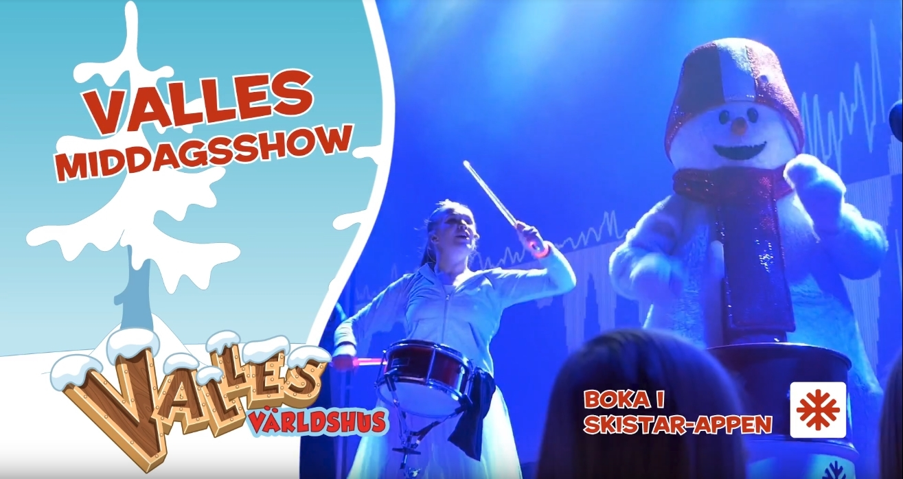

## Summary 

### Live and studio environment audio engineering
* Set up PA's and rigging before a show
* Soundcheck and audio mixing techniques
* Audio recording & sound design
* Mastering audio 
* Bachelor's degree in sound & music production

### Lights 
* DMX adressing and setting up lighting 
* Experience with Avolites equipment
* Taking full advantage of collaborative synchronized programming of audio and lighting setup

-----------------

## Other Skills

### Video
* Implementing audiovisual content with lighting
* Experiences with drones and steadycams 
* Synchronising external audio recorders with industry standard camera setups 
* Experiences with industry standard adobe software 

### Stagecrafting, show business 
* Previous experiences collaborating with external companies rigging and mounting up stages with props

## Other

### I always strive to learn new things 
* Working with different projects regarding audio, video, lights, marketing, and web design

### Driver's license 
* Driver's license since 2013

### Well-rounded formal education:
* [University of Dalarna](http://www.du.se/en/study-at-du/Program/programme-syllabus/?code=KSMPG) Bachelor's degree
